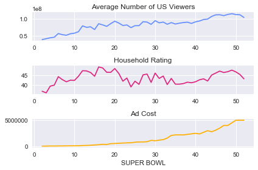

title: Suraj Suresh 
logo: "/Images/Logo.jpg?raw=true"
## Hello and thank you for visiting my webpage. This page explains the steps I have taken towards being a data scientist. I began this journey in 2019 and since then I'm extracting knowledge from multiple platforms eg courses, books, podcasts,twitter,youtube etc. 
## My passion for data science comes from my love for technology and I'm trying my best to learn as much as I can with the time provided. Any feedback with respect to my projects is accepted and would love to learn your point of view. 

# My Data Science Journey
# [Project 1: TV, halftime shows, and the Big Game](https://github.com/Suraj-MachineTeacher/Project-1-Data-Visualization/blob/master/Data%20Visualization%20Super%20Bowl%20Performance.ipynb)
Whether or not you like football, the Super Bowl is a spectacle. There's a little something for everyone at your Super Bowl party. Drama in the form of blowouts, comebacks, and controversy for the sports fan. There are the ridiculously expensive ads, some hilarious, others gut-wrenching, thought-provoking, and weird. The half-time shows with the biggest musicians in the world, sometimes riding giant mechanical tigers or leaping from the roof of the stadium. In this notebook, we're going to find out how some of the elements of this show interact with each other. After exploring and cleaning our data a little, we're going to answer questions like:

* What are the most extreme game outcomes?
* How does the game affect television viewership?
* How have viewership, TV ratings, and ad cost evolved over time?
* Who are the most prolific musicians in terms of halftime show performances?

